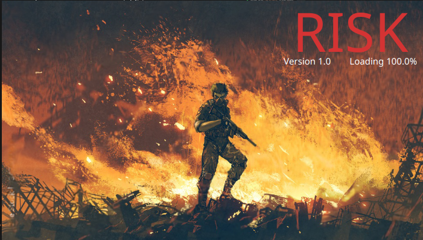
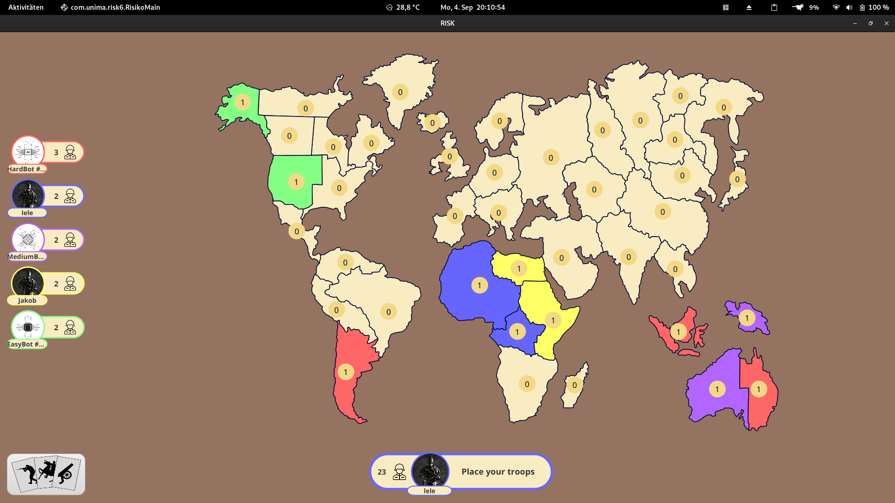
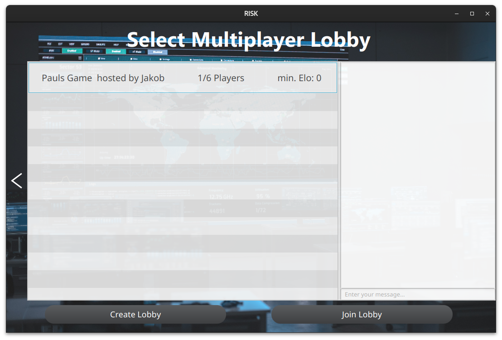
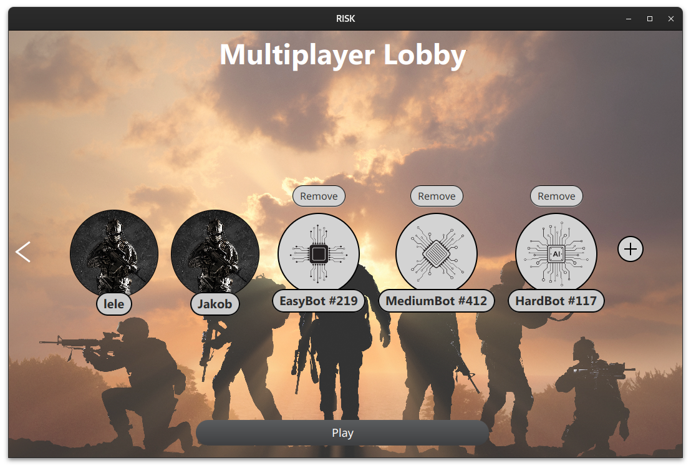

# Risk Game

This repository contains the implementation of the Risk game in Java, developed as part of a
university project and following a Unix-first philosophy.

<p align="center">
  
</p>

# Overview

## What is risk?

The Risk game is a classic board game of strategy and conquest, where players aim to conquer
territories and eliminate opponents. The objective is to occupy every territory on the map and
eliminate all other players. The game involves dice rolling, tactical planning, and diplomatic
negotiations.
<p align="center">
  
</p>

## Features

Discover the Features of Risk6

- Online Multiplayer: Enjoy global competition with our online multiplayer mode.
- Perfect for LAN Parties: Gather your friends and enjoy thrilling Risk matches at LAN parties.
- Multi-User Profiles: Create and manage multiple user profiles for a personalized gaming
  experience.
- Three Types of Bots: Challenge yourself with various AI opponents, including one utilizing Monte
  Carlo Tree Search.
- In-Game Chat: Communicate and strategize with your opponents or allies using our in-game chat
  feature.
- Game Statistics: Keep track of your progress and improve your strategy with detailed game
  statistics.
- Platform Independence: Play seamlessly across different devices thanks to our platform-independent
  design.
- SSL Encrypted: Rest assured, your gaming sessions are secure with SSL encryption.

- Enterprise Architecture: Our game is built on an enterprise architecture for easy maintenance and
  expansion.
- Scalable Server Architecture: Experience smooth gameplay with our scalable server architecture
  based on Netty and Websockets

Get ready for an exciting gaming experience that combines cutting-edge technology with classic
strategy gameplay!"

<p align="center">
  
  
</p>

# Installation

## Supported Systems

Thoroughly Tested on Arch Linux and Mac (Intel and Apple silicon)

Our game has undergone extensive testing on Arch Linux and Mac systems, including both Intel and
Apple Silicon platforms, ensuring a seamless gaming experience. The prebuilt JAR runs on Windows,
Linux, and Mac (Intel and Apple Silicon). For other platforms, you can build the JAR yourself,
provided JavaFX 19 is supported. Enjoy our game on your chosen system!"

 System     | Support 
------------|---------
 Linux      | &check; 
 Mac        | &check; 
 Windows 10 | &check; 
 Windows 11 | &check; 

## Install Java 17

You need a Java 17 runtime environment to execute the game. You can check this by
typing ```java --version``` in your console.

If your output doesnt have the number 17 in it, follow the instructions below to install Java. If
you have Java 17 installed just proceed with installing the game.

### Linux

- Arch Linux: ```sudo pacman -S jdk17-openjdk && sudo archlinux-java set java-17-openjdk```
- Debian/Ubuntu and
  Derivates: ```sudo apt install openjdk-17-jdk && sudo update-alternatives --config java```
- Fedora: ```sudo dnf install java-17-openjdk && sudo alternatives --config java```

You may also need to install ffmpeg or deprecated version of ffmpeg. Visit the troubleshooting
section for more information.

### Mac

Download the OpenJDK-installer for your
architecture [here](https://adoptium.net/de/temurin/releases/?package=any&os=mac&version=17) and
install it. __Ensure that you download the aarch64 installer if you're using an apple silicon mac!__

### Windows

Download the OpenJDK-installer for your
architecture [here](https://adoptium.net/de/temurin/releases/?package=any&os=windows&version=17) and
install it.

## Install the Game

1. Download the current release [here](https://github.com/AndreyJRE/risk6/releases).
2. Once downloaded, you need to double-click on 'risk6.jar' to start the game. If this doesn't work,
   open your terminal, ensure that you are in the same folder, and type ```java -jar risk6.jar```
   for further information.
3. If you encounter problems with multi-player, you must open port 42069 for both UDP and TCP
   protocols in your firewall.
4. Have fun :D

## Documentation

1. If you want to know more about the game structure and how it was designed, you can find the developer manual
   [here](docs/DeveloperManual.pdf).

2. For additional information of the game and its features, you can find the user manual [here](docs/UserManual.pdf).

<sup><sub>Used
ressources:<a href="https://www.flaticon.com/free-icons/board-game" title="board game icons">Board
game icons created by Freepik - Flaticon</a></sub></sup>


